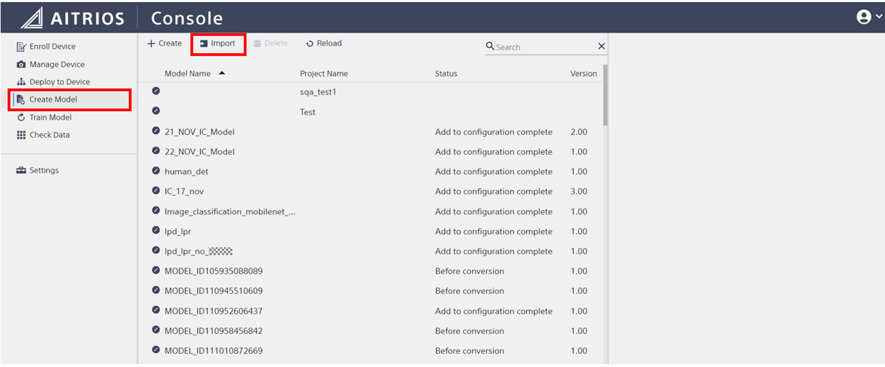
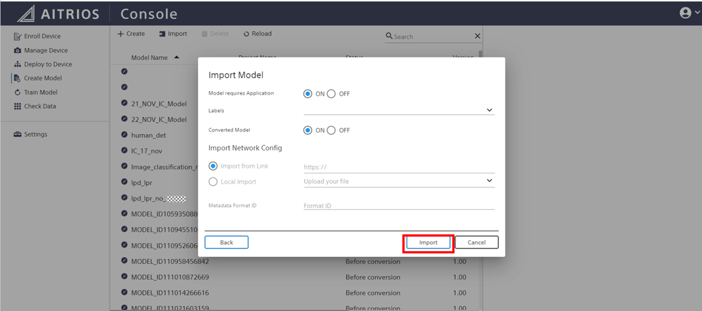
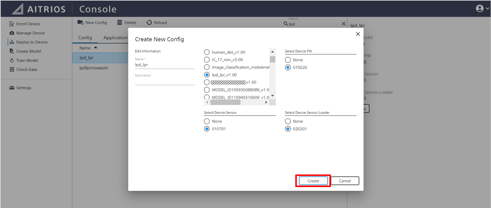
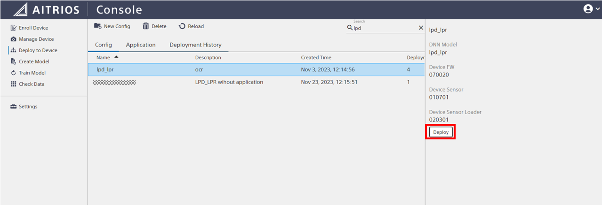
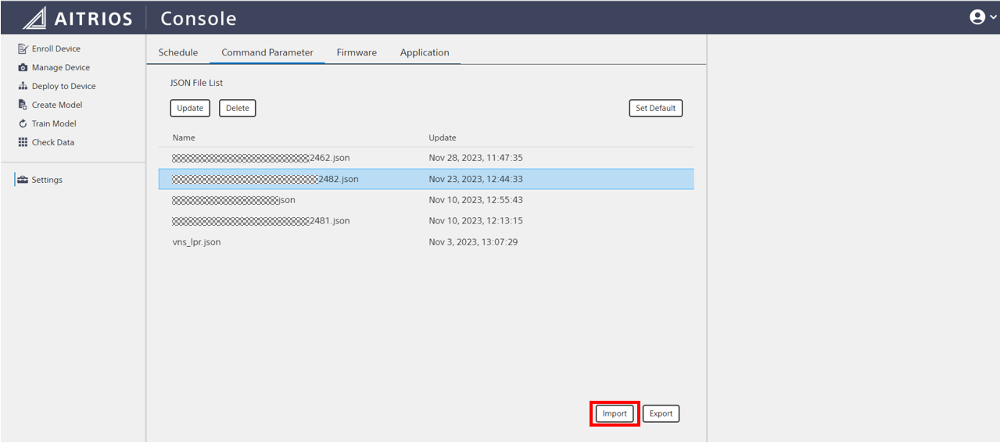
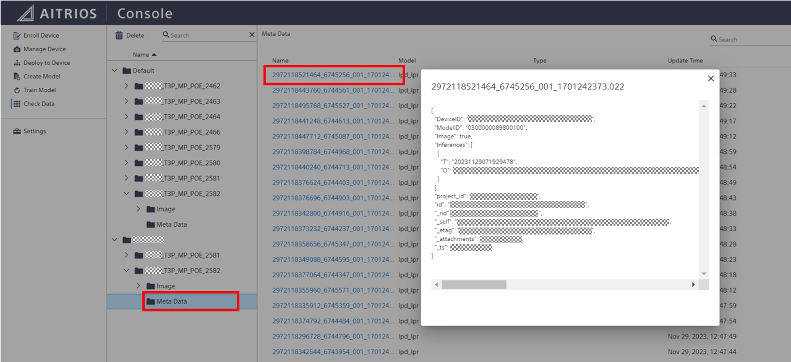

_**Note:**_ Below steps for setup is only a sample and it may change in future.

* Prerequisites
+
The following service and Edge Device are required to run this software.
+
.. Buy Console Developer Edition Basic Plan.
.. Buy Edge Device.
.. Buy Azure account and subscription.

* Import LPD LPR model.

.. Download LPD LPR model and its Edge App file.

.. Go to "**AITRIOS Console**" in browser, click "**Create Model**" from sidebar and click [**import**]
+

.. Import Model pop up appears and enter "**Model ID**", upload the LPD LPR Model `packerOut.zip` file and click [**Next**]
+

.. Turn "**ON**" for "**Model requires Application**" and "**Converted Model**" and Click [**Import**].
+

* Create New Config.
.. click "**Deploy to Device**" from sidebar and click [**New Config**]
+

.. Pop up appears and Enter the "**Config Name**" and "**Select imported model**", "**Select Device FW**" as `070020`, "**Select Device Sensor**" as `010701`, "**Select Device Sensor Loader**" as `020301` and click [**Create**]
+

.. We can find created new config in list. And click [**Deploy**]
+

* Deploy Model to Device.
.. After clicking on Deploy from Previous step the pop appears, Select Device of interest and click [**Next**]
+
image::aitrios_imgs/deploy_model/step1.png[]

.. Add or Replace the model based on the Device Model availability and click [**Deploy**] which usually takes a while to complete the process.
+

.. Go to "**Manage Device**" from sidebar and select device in which model is deployed and confirm if the Model is deployed
+

* Import Edge App.
.. Go to "**Settings**" from sidebar and select "**Application**" from the tab and click [**import**] 
+
image::aitrios_imgs/import_wasm/step1.png[]

.. "**Import Device App**" pop up appears, Upload the `Edge App file`, enter the "**Name**", "**Version**", "**Description**" and click [**Next**].
+
image::aitrios_imgs/import_wasm/step2.png[]

.. Click [**Create**]
+

.. Go to "**Deploy to Device**" from sidebar and select "**Application**" from the tab, Search for deployed Edge App file from the list and click on [**Deploy**].
+
image::aitrios_imgs/import_wasm/step4.png[]

* Deploy Edge App to Device.
.. After clicking on [**Deploy**] from previous step, Pop up appears and select the device to which it needs to be deployed and click [**Deploy**].
+
image::aitrios_imgs/deploy_wasm/step1.png[]

.. Go to "**Manage Device**" from sidebar, select the device to which Edge App was deployed and go to "**Status**", "**Application**" and check if the "**App Name**" has the deployed Edge App file name from previous step.
+
image::aitrios_imgs/deploy_wasm/step2.png[]

* Bind Command Parameter File.
.. Create the `Command Parameter` file as below parameters and Replace `ModelId` parameter with your Model ID.
+
[source,json,subs="+attributes"]
----
{
  "commands": [
    {
      "command_name": "StartUploadInferenceData",
      "parameters": {
        "Mode": 1,
        "ModelId": "_Your_Model_ID_",
        "UploadMethod": "BlobStorage",
        "FileFormat": "JPG",
        "UploadMethodIR": "MQTT",
        "CropHOffset": 0,
        "CropVOffset": 1114,
        "CropHSize": 4056,
        "CropVSize": 810,
        "NumberOfImages": 30,
        "UploadInterval": 1,
        "NumberOfInferencesPerMessage": 1,
        "MaxDetectionsPerFrame": 5,
        "PPLParameter": {
                    "plate_text_confidence_score_threshold": 0.1
                }
      }
    }
  ]
}
----
_**Note:**_ Please contact AI model provider for latest command parameter file.

.. Click [**import**] and upload the `command parameter` file.
+

.. Go to "**Manage Device**" from sidebar, select the device of interest and Expand "**Settings**", `Command Parameter File` and  [**Unbind**] the old command parameter file and [**Bind**] new command parameter file.
+

* Start Inference from Console.
.. Expand "**Settings**", "**Inference Control**" and Switch on "**Get Inference Data**" to start the inference.
+

.. Go to "**Check Data**" from sidebar, Go to device of interest where the inference was started, expand "**image**" and click on the last item from the list to see latest inference images.
+

.. Also we can check "**Meta Data**" by selecting the option under the Device ID and click on latest generated file in the list then pop up appears with "**Meta Data"** content.
+
