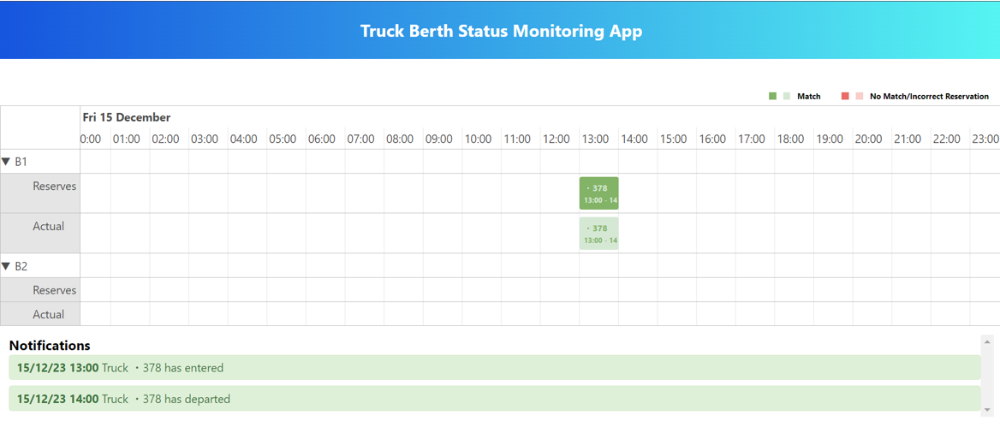
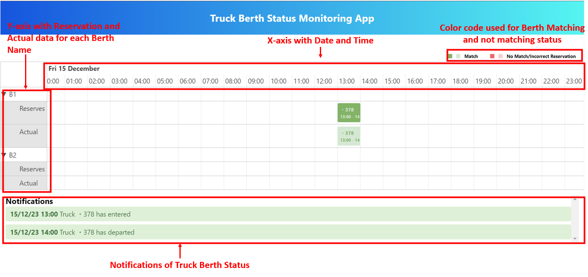
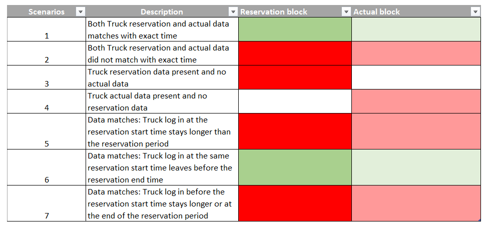
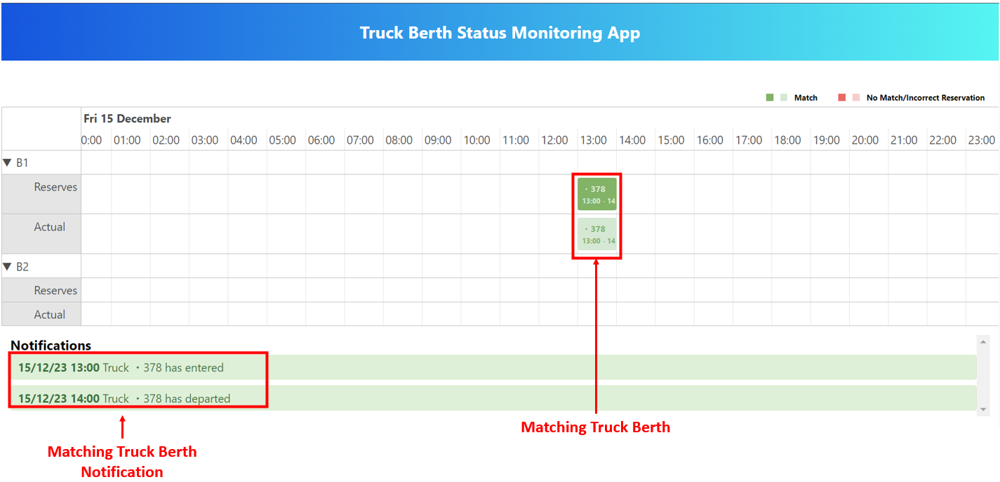
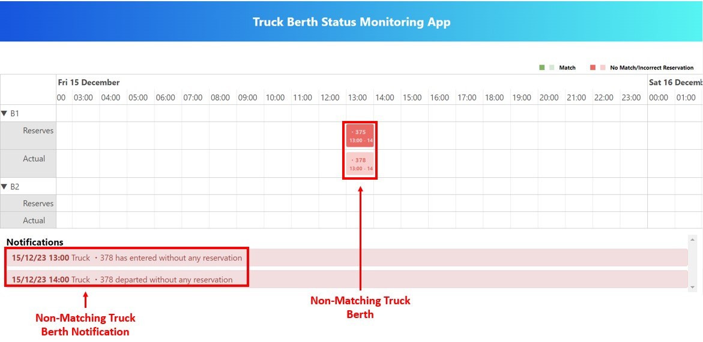
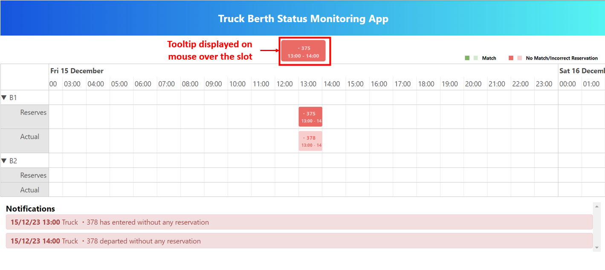

- Start application in your local using chrome browser. Please see - xref:setup_and_installations.adoc#installation-guide[Installation and setup]
+

- UI Displays date and time in x-axis and Berth name with Reservation, Actual data in y-axis, Notification List of Truck status and Color code which is used to display different status.
+

<<<

- Block colors based on scenarios
+

- If there is Matching of Reserved truck number with Actual data for a given time and slot then the berth slots are highlighted to Green color and also the Truck entered and exit status is notified.
+

<<<

- If there is Non-Matching of Reserved truck number with Actual data for a given time and berth slot then the slots are highlighted to Red color and also the Truck entered and exit status is notified.
+

- On mouse over for any slot the tool tip is displayed with its content at the top of the graph.
+

- UI will refresh for Truck Berth status and latest notification periodically in particular period of time.
